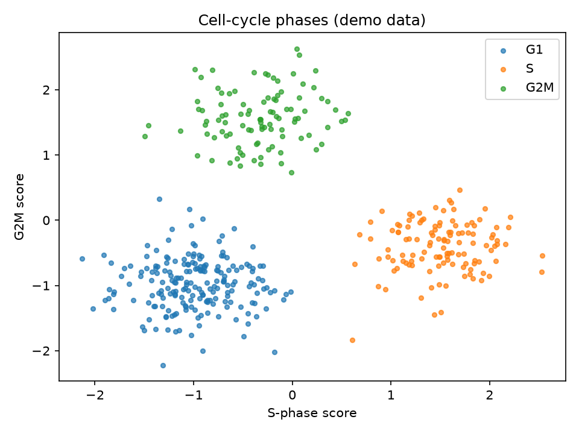

# Cell Cycle Phase Scatter

In single-cell data, proliferating cells can masquerade as a distinct cell type — when really they are just the same cells caught mid-division. Cell-cycle scoring unmasks them.

## Why This Matters

Cell-cycle genes are among the strongest signals in scRNA-seq, and if you ignore them, dividing cells cluster on their own and you mistake a phase for a cell type. Scoring each cell for S-phase and G2M markers lets you either label or regress out the cycle, so your clusters reflect biology, not proliferation.

## How It Works

1. Score each cell for S-phase and G2M marker gene expression.
2. Plot the two scores against each other.
3. Cells fall into G1, S, or G2M regions.

## What the Demo Shows



The demo scores synthetic cells and plots S against G2M scores. Three clear groups appear (G1, S, G2M) — the pattern you use to assign each cell a phase before deciding whether to correct for it.

## Run It

```bash
pip install -r requirements.txt
python demo.py
```

> Demonstrated on synthetic data, so it's fully reproducible with no external downloads.
